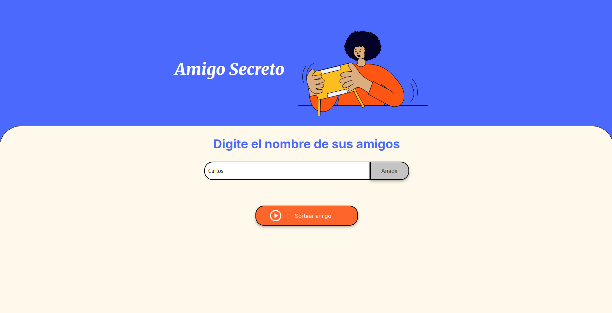
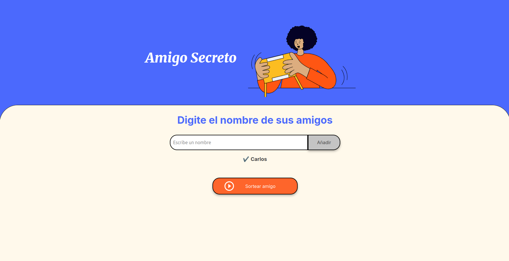
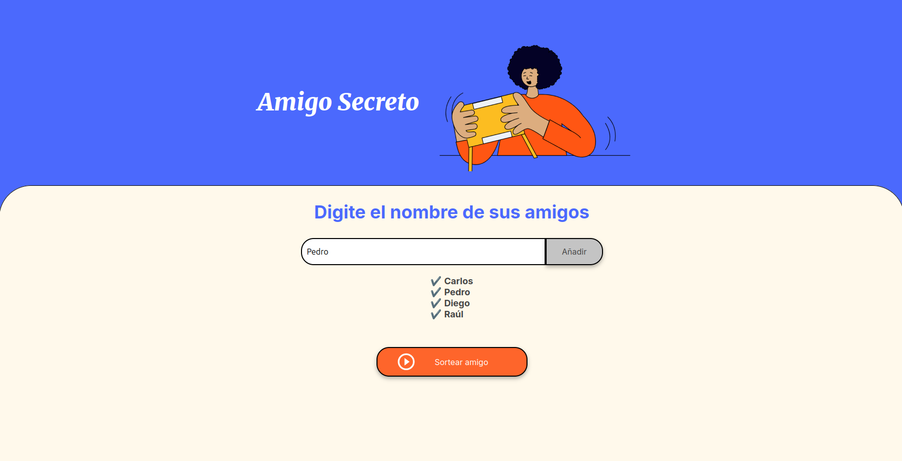
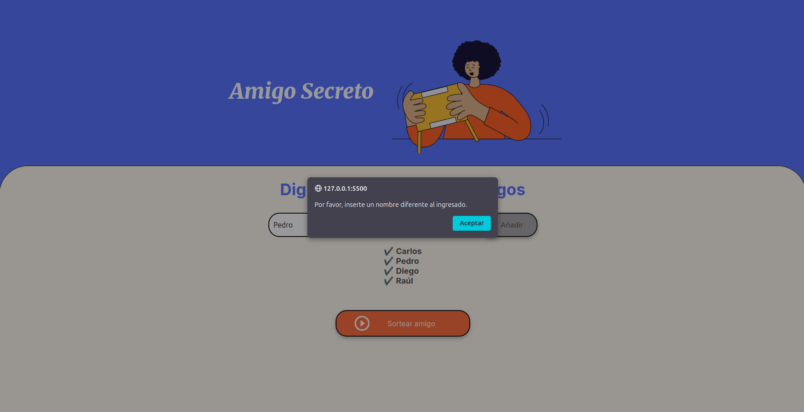
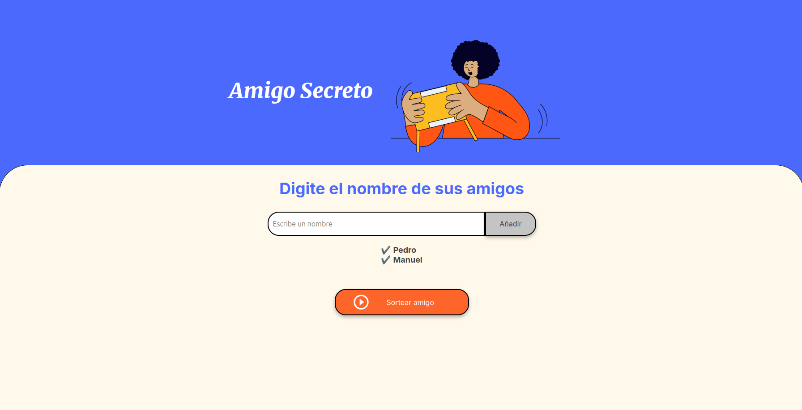
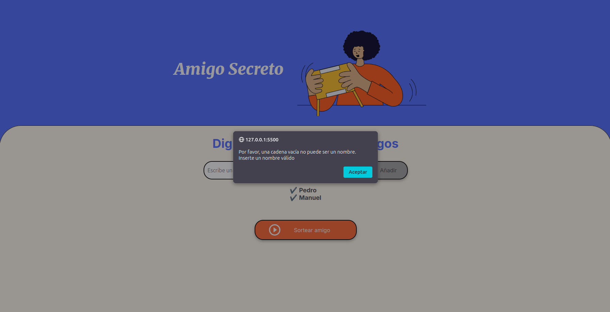
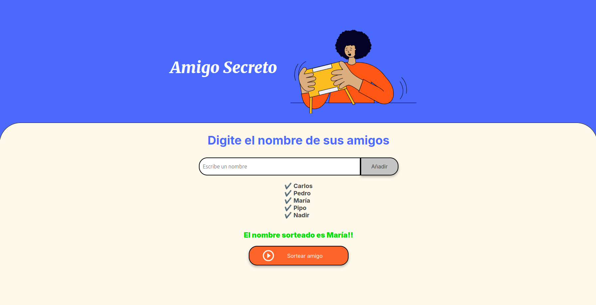

# Proyecto: Amigo Secreto

<p align="center">
  
</p>


<p align="center">
    
    
</p>

## 📄 Descripción del proyecto 

El presente proyecto es un sistema web que emula el sorteo de un nombre de una lista de amigos, los cuales previamente se ingresarán.

## 🛠️ Funcionalidades del proyecto
* `Ingreso de nombres`: El sistema permitirá al usuario ingresar los nombres que formarán parte de la lista de amigos.

    ### Digitacion del nombre
    
    
    ### Inclusioń del nombre a la lista
    


* `Validación de nombres`: El sistema validará los nombres ingresados, para ello controla casos como el ingreso de una cadena vacía o un nombre repetido. Además, para que el nombre sea válido se toma en consideración que este como mínimo tenga tres caracteres.

    ### Ingreso de un nombre repetido
    
    
    ### Alerta de repetición
    

    ### Ingreso de cadena vacía
    
    
    ### Alerta de cadena vacía
        

* `Sorteo de nombres`: El sistema sorteará un nombre de la lista una vez se haga clic en el botón.

    ### Digitacion del nombre
    

## 👀 Posibles problemas y soluciones

El sistema está desarrollado bajo algunos supuestos que durante el uso podrían disminnuir la experiencia, tales como:

* Si bien el sistema permite sortear un nombre de una lista ya ingresada, para volver a ingresar a otra lista se debe recargar la página. Esto puede manejarse con la incorporacion de un botón, una vez se quiera borrar la lista de amigos actual.
* A nivel de interfaz, una vez se ingresan un cantidad considerable de nombres se genera un scroll lo que podría generar incomodidad. Esto podría manejarse con el empleo de código html y css, en los elementos `<li>` los cuales contienen los nombres ingresados.
* A nivel de accesibilidad, se podría incorporar una funcionalidad tal que permita, mediante audio, realizar las funciones del sistema. De tal forma, que ya no solo sea un tema de escritura sino que mediante voz también se pueda realizar el flujo del sorteo. 

## 📋 Tecnologías empleadas

El sistema está desarrollado con tecnologías básicas, siendo estas las siguientes:

* HTML.
* Javascript.
* CSS.

## 📁 Acceso al proyecto

* Dado que el sistema está desarrollado con tecnología básica no requiere de algo adicional a la clonación del repositorio.
* Para la clonación, ejecute el siguiente comando.

    ```
    git clone https://github.com/laion16/desafio-amigoSecreto.git
    ```

## ⚙️ Despliegue del sistema

Puede probar la [demo](https://laion16.github.io/desafio-amigoSecreto/) del sistema, el cual fue desplegado en GitHub Pages.

## 🚨 Licencia

Este proyecto está bajo la Licencia (MIT) - mira el archivo [LICENSE](./LICENSE) para detalles.

## 🖋️ Autor

* **Laion16** - *Desarrollo de las funcionalidades sistema / Documentación* - [Laion16](https://github.com/laion16)